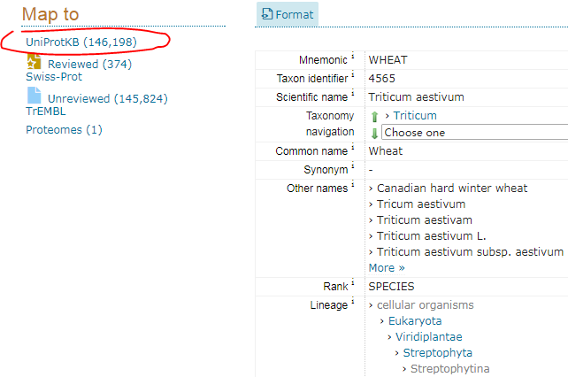
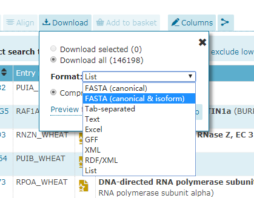

# 非模式生物BBH映射

对于非模式生物，由于可能在KEGG数据库之中或者网络上还没有公开的可以使用的注释数据作为功能富集分析的背景，故而我们将无法直接使用网络上的公开的生物学功能富集计算服务。这个时候会需要使用BBH注释的方法，将非模式生物之中的蛋白质映射到一个和目标物种分类上较为接近的有效的模式生物的基因组之中的对应蛋白质之中，之后再利用这个映射的结果进行功能富集分析。

### 选择模式生物

可以利用UniProt Taxonomy工具来完成模式生物的选择，一般而言，在UniProt数据库之中可以搜索得到待分析的目标物种的话


<br />


可以在Taxonomy之中往上一级分类查找或者在同一级分类之中查找出模式生物，得到了模式生物之中，从Uniprot数据库之中下载该模式生物的所有的蛋白质序列备用。同样的，将待分析的物种的蛋白组结果之中的蛋白编号列表取出来，利用Uniprot数据库之中的批量编号映射工具获取得到相对应的蛋白序列备用。

<div style="page-break-after: always;"/>





<div style="page-break-after: always;"/>

### BBH双向blastp比对

在本地安装NCBI的localblast+分析套件，分别使用makeblastdb命令对上一个步骤所得到的模式生物蛋白序列库，以及待分析的物种的蛋白序列进行建库操作，在这里我们将待分析的物种的蛋白序列库标记为query，将得到的模式生物的蛋白序列库标记为subject，则有下面的工作命令

```bash
# 建库
makeblastdb -in "query.fasta" -dbtype prot
makeblastdb -in "subject.fasta" -dbtype prot

# BBH搜索
blastp -query "query.fasta" -db "subject.fasta" -evalue 1e-5 -o "qvs.txt" -num_threads 2
blastp -query "subject.fasta" -db "query.fasta" -evalue 1e-5 -o "svq.txt" -num_threads 2
```

### 建立映射关系

利用localblast工具进行BBH结果的导出

```bash
localblast /bbh.EXPORT /query "query.fasta" /subject "subject.fasta" /trim /coverage 0.85 /identities 0.3
```

通过Excel将计算结果数据之中的差异表达基因所对应的模式生物的BBH映射结果提取出来，最后我们就可以利用获取的到的BBH的搜索结果按照正常的步骤进行KOBAS或者DAVID的功能富集分析即可。


