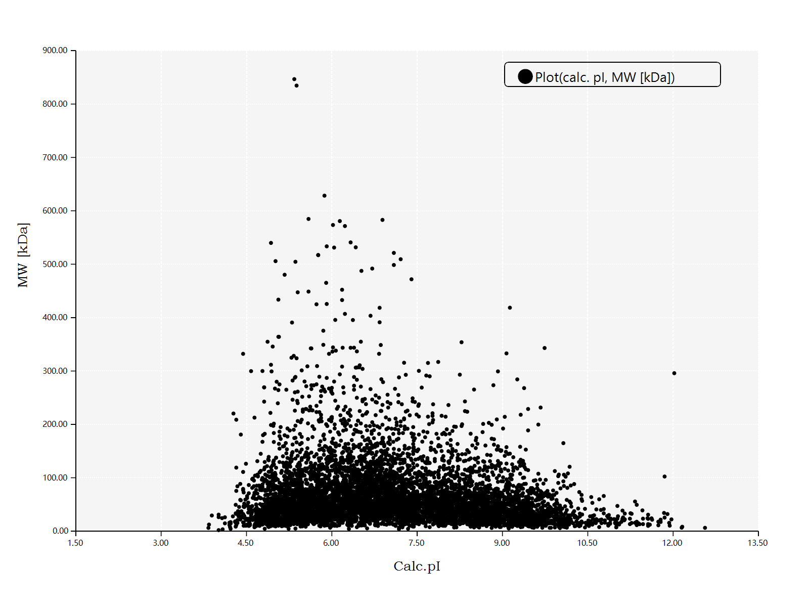
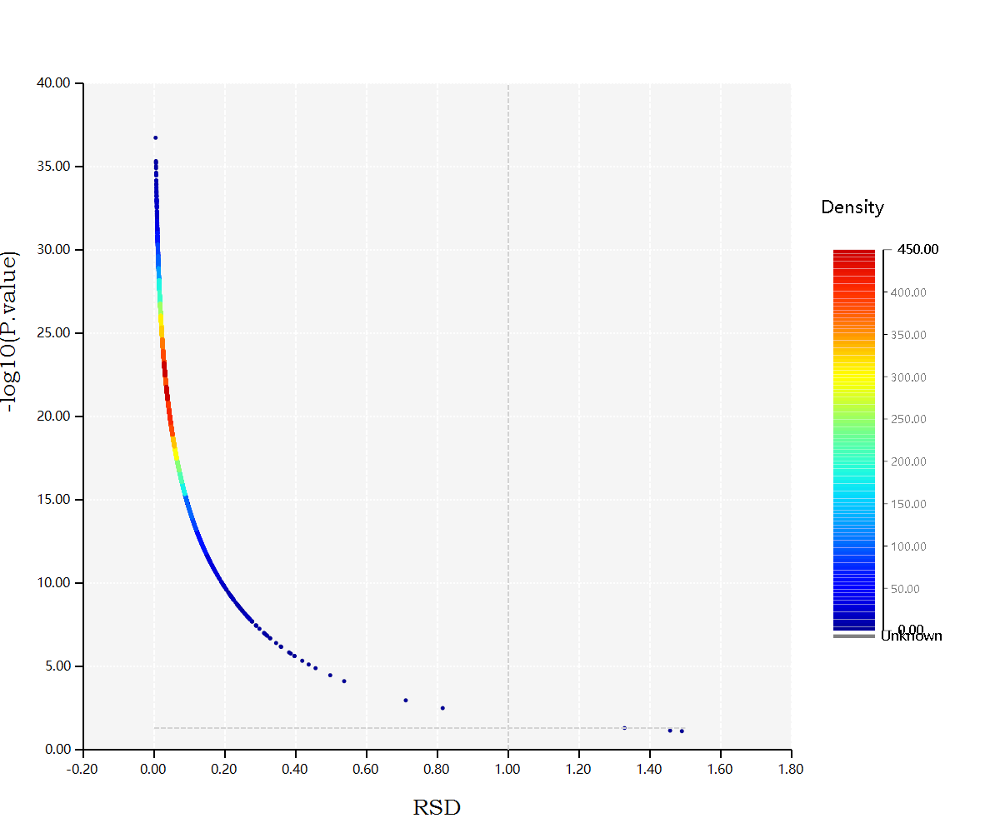
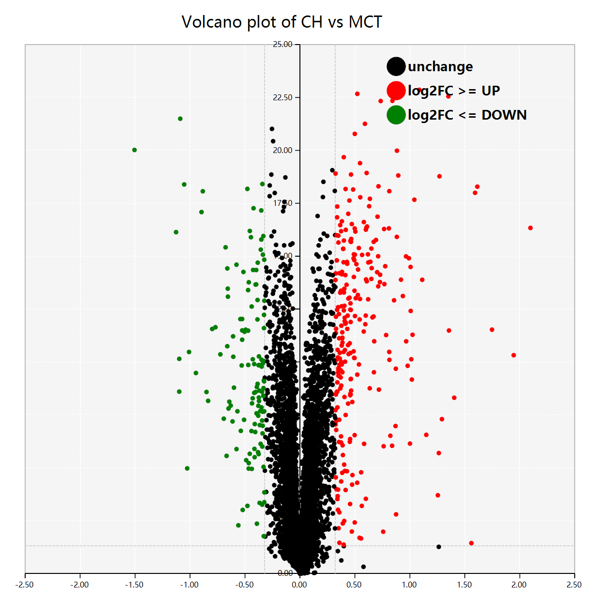

# iTraq数据分析

## 符号替换

iTraq的数据结果之中的样本都是使用数字形式的通道编号来进行命名的，为了方便进行数据分析，需要在分析的最开始进行符号的替换操作，首先需要准备Excel模板：

| Symbol | SampleID | AnalysisID | SampleGroup |
|--------|----------|------------|-------------|
| number | name     | name       | name        |

例如，有如下样品的表格

| 组别   | Con1 | Con2 | Con3  | CH1  | CH2  | CH3  | MCT1 | MCT2 | MCT3  |
|------|------|------|-------|------|------|------|------|------|-------|
| 样本名称 | 1-5  | 6-10 | 11-15 | 1-4  | 5-8  | 9-12 | 1-5  | 6-10 | 11-15 |
| 标记信息 | 126  | 127C | 128N  | 128C | 129N | 129C | 130N | 130C | 131   |

则对应的符号表格为：

| Symbol | SampleID | AnalysisID | SampleGroup |
|--------|----------|------------|-------------|
| 126    | CON1     | CON1       | Con         |
| 127_C  | CON2     | CON2       | Con         |
| 128_N  | CON3     | CON3       | Con         |
| 128_C  | CH1      | CH1        | CH          |
| 129_N  | CH2      | CH2        | CH          |
| 129_C  | CH3      | CH3        | CH          |
| 130_N  | MCT1     | MCT1       | MCT         |
| 130_C  | MCT2     | MCT2       | MCT         |
| 131    | MCT3     | MCT3       | MCT         |

将原始数据之中的数据表格导出为csv文件之后，使用下面的命令进行原始数据之中的符号替换：

```bash
# /in 参数为从原始数据导出来的csv表格
# /symbols 参数则是编辑完成的符号表格的csv文件
eggHTS /iTraq.Symbol.Replacement /in "iTraq.data.csv" /symbols "symbols.csv"
```

<div style="page-break-after:always;"></div>

## 样本的基本性质：等电点离子图

在这里通过等电点离子图初步了解总蛋白样本的生物化学性质，所使用到的命令如下：

```bash
# /in 参数为从原始数据之中导出来的csv文件
eggHTS /plot.pimw /in "samples.csv"
```

上面的命令所产生的图表如下：



<div style="page-break-after:always;"></div>

## 比对分组

这一步需要编辑好进行后续差异蛋白分析所需要的``sampleInfo``信息以及样本的比对分组信息

### sampleInfo

表格的模板如下所示：

| Order | ID   | color    | shapetype | sample_name  | sample_group |
|-------|------|----------|-----------|--------------|--------------|
| 序号    | name | 一般使用默认颜色 | 一般使用默认形状  | 在报告之中进行显示的名称 | 当前的这个样本所处的分组 |

假设有如下的样本分析需求单信息：


则对应的sampleInfo表格为：

| Order | ID   | color | shapetype | sample_name | sample_group |
|-------|------|-------|-----------|-------------|--------------|
| 0     | Con1 |       |           | Con1        | Con          |
| 1     | Con2 |       |           | Con2        | Con          |
| 2     | Con3 |       |           | Con3        | Con          |
| 3     | CH1  |       |           | CH1         | CH           |
| 4     | CH2  |       |           | CH2         | CH           |
| 5     | CH3  |       |           | CH3         | CH           |
| 6     | MCT1 |       |           | MCT1        | MCT          |
| 7     | MCT2 |       |           | MCT2        | MCT          |
| 8     | MCT3 |       |           | MCT3        | MCT          |

<div style="page-break-after:always;"></div>

### Analysis Designer

进行差异蛋白计算分析的时候需要知道样本所对应的分组信息

表格的模板如下所示：

| Controls | Treatment | Note                  |
|----------|-----------|-----------------------|
| 分组名称     | 分组名称      | controls vs treatment |

加入有如下的分析比对的需求，则对应的比对分析信息表格为：


| Controls | Treatment | Note                             |
|----------|-----------|----------------------------------|
| Con      | CH        | Con vs CH (产生的比值结果为``CH/Con``)   |
| Con      | MCT       | Con vs MCT (产生的比值结果为``MCT/Con``) |
| CH       | MCT       | CH vs MCT (产生的比值结果为``MCT/CH``)   |

在完成了第一步的符号替换之后，以及填写完了样本信息以及分组信息之后就可以对原始数据表格进行矩阵的分割了：

```bash
# /in 在第一步符号替换所得到的原始的数据矩阵文件
# /sampleInfo 在本步骤之中所填写得到的sampleInfo表格文件
# /designer 分析的比对分组信息表格
eggHTS /iTraq.matrix.split /in "matrix.csv" /sampleInfo "sampleInfo.csv" /designer "analysis.csv" /allowed.swap 
```

<div style="page-break-after:always;"></div>

## iTraq实验质量控制：RSD密度线

iTraq蛋白组原始数据的质量可以通过RSD密度线来描述：

```bash
eggHTS /iTraq.RSD-P.Density /in "matrix.csv" 
```

在上一个步骤之中，通过sampleInfo以及比对分组信息的表格，从``/iTraq.matrix.split``命令结果之中可以得到每一个所定义的比对分组所需要的计算矩阵，例如，在上一个步骤之中有``Con vs CH``，``Con vs MCT``，``CH vs MCT``这三个比对的分组定义信息，则会产生三个以这三个分组命名的矩阵表格文件，则在这里进行密度线的绘制过程之中的``/in``参数就是得到的这三个比对分组的矩阵文件。

生成的RSD密度线图片如下所示：



横坐标为RSD，值越小越好，iTraq蛋白组的原始数据的RSD一般小于1
纵坐标为pvalue所计算出来的P值，值越大越好

一般而言，iTraq实验之中的平行样重复性越好，则RSD越小，P值越大

<div style="page-break-after:always;"></div>

## 差异蛋白计算分析

将比对分组所产生的数据矩阵作为本步骤的t-test检验计算的输入，即可完成差异蛋白的计算分析，命令如下：

```bash
# /level 设置的为log2FC的阈值，默认是log2(1.5)，如果差异蛋白数量过少，可以设置为1.25
# /p.value pvalue的阈值，一般默认使用0.05
# /FDR 进行假阳性校验的阈值，一般默认使用0.05
eggHTS /iTraq.t.test /in "matrix.csv" /level 1.5 /p.value 0.05 /FDR 0.05
```

这个命令所生成的结果表格的表头解释如下：

| headers | note                                                      |
|---------|-----------------------------------------------------------|
| ID      | 一般是对蛋白进行唯一标记的UniProt蛋白编号                    |
| FC.avg  | FoldChange值的平均值                                       |
| p.value | 平行试验的稳定性，平行试验重复性越好，pvalue越小，一般小于0.05 |
| is.DEP  | 根据所设定的阈值条件，当前的这个蛋白是否是差异蛋白？           |
| log2FC  | 差异倍数的log2计算结果                                      |
| FDR     | 假阳性校正的计算结果，值一般小于0.05，越小越好                |
| etc.    | 剩余列都是进行计算的原始输入矩阵                              |

### 差异蛋白火山图

在完成了差异蛋白的计算分析之后，就可以通过``/DEP.logFC.Volcano``命令进行火山图的绘制操作

```bash
# /in 这个参数需要上一步所计算出来的差异表达蛋白的结果表格
# /p.value 纵坐标阈值线，需要与上一步骤计算所使用的阈值保持一致
# /level 横坐标的阈值线，需要与上一步骤计算所使用的log2FC阈值保持一致
eggHTS /DEP.logFC.Volcano /in "t.test-table.csv" /p.value 0.05 /level 1.5
```



至此，完成了与iTraq的原始数据相关的的所有处理操作，后续的数据分析都是通用的生物信息学注释以及功能富集分析。
